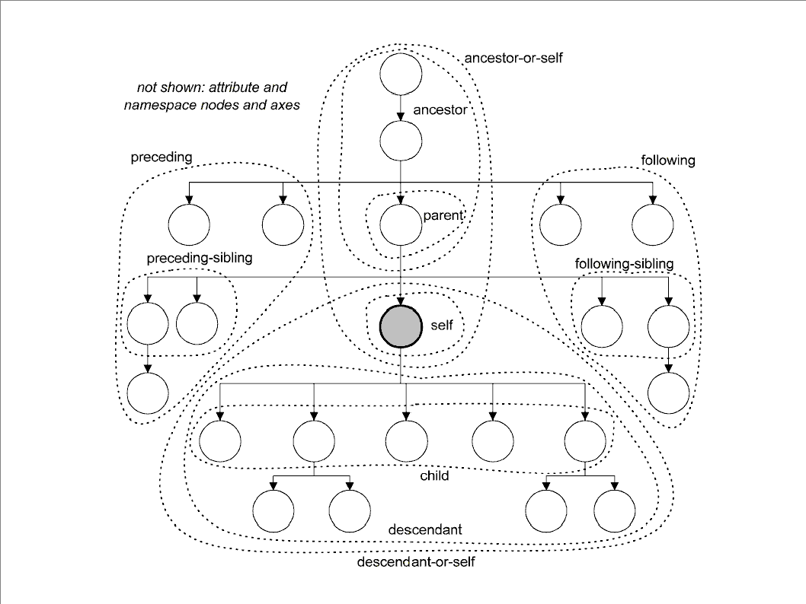

# Was ist XPath
XPath ist eine Syntax, die in XSLT, XQuery und anderen X-Technologien verwendet wird, um in XML-Dokumenten zu navigieren und "Rückgaben" zu erzeugen. 
Dabei können zum Beispiel Teilbäume extrahiert, Daten manipuliert oder Elemente gezählt werden.  

# Knotentypen
- Dokumentknoten (wird mit `/` adressiert, um das Dokument einzulesen)
- Wurzelknoten (`TEI`)
- Elementknoten (`opener`, `closer`, `persName`)
- Attributknoten (`@ref`, `@type`) 
- Textknote (`text()`)

# XPath-Navigation
- Ein Lokalisierungsschritt besteht aus einer Achsenangabe, dem Knotentext und ggf. einem Prädikat: `/body//persName[@key='A000584']`

  
- Navigieren Sie über die Achsen `child::` (Kurzversion ohne Achsenangabe) und `descendant::` (Kurzversion //)
- Probieren Sie die Achsen `preceding` und `preceding-sibling` aus. (Es gibt äquivalente Achsen mit "following".)
- Wenden Sie Prädikate als boolesche Filter an, indem Sie `[. . .]` verwenden.
- Sehen Sie sich XPath-Funktionen an:
    - `normalize-space()`
    - `count()`
    - `distinct-values()`
    - Es gibt verschiedene Stile, diese Ausdrücke zu schreiben: Verschachtelung (XPath 2) vs. **simple-map**: `!` und Pfeiloperator: `=>` (XPath 3)
        - `//*/normalize-space()` (XPath 2) vs. `//* ! normalize-space()` (XPath 3) bedeuten dasselbe.
        - `text()`-Knoten vs. `//string()` und eine "tiefgehende" Diskussion darüber, was `normalize-space()` bewirkt.
        - Grundlegende mathematische und arithmetische Operationen.

# XPath-Ausdrücke
- Welcher XPath findet die Absätze in der Datei?
- Welcher XPath findet nur die Absätze im \<body\>-Element?
- Welcher XPath identifiziert nur das \<persName\>-Element im \<closer\>?
- Welcher XPath findet den Namen des Absenders / der Absenderin?

## Für Briefe mit kodierten Namen
- Welcher XPath findet alle in dem Brief kodierten Personennamen?
- Wie viele gibt es davon?
- Welcher XPath findet die Werte des @ref-Attributs in den \<persName\>-Elementen?
- Welche Funktion findet die eindeutigen Attributwerte?
